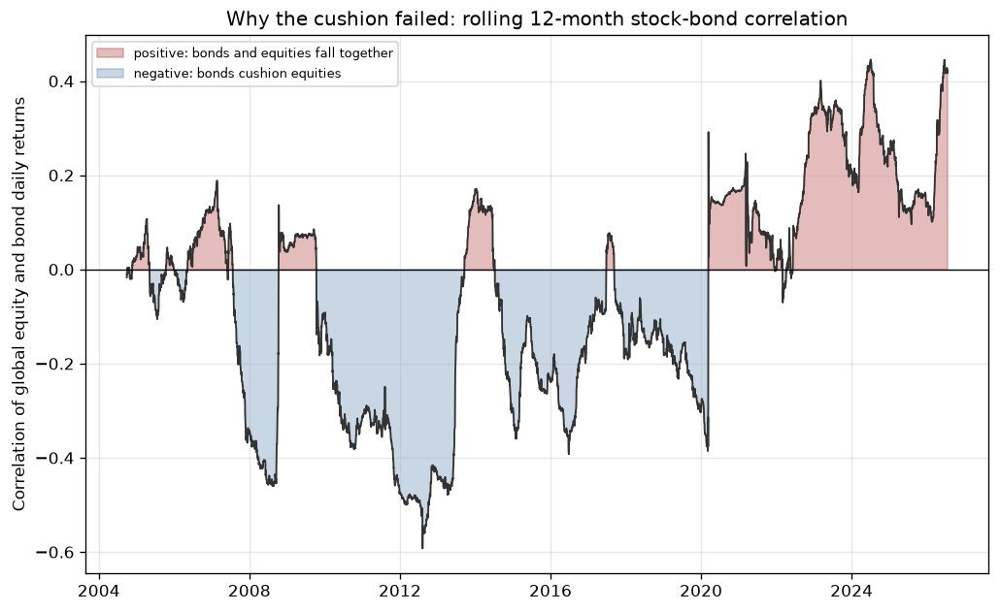
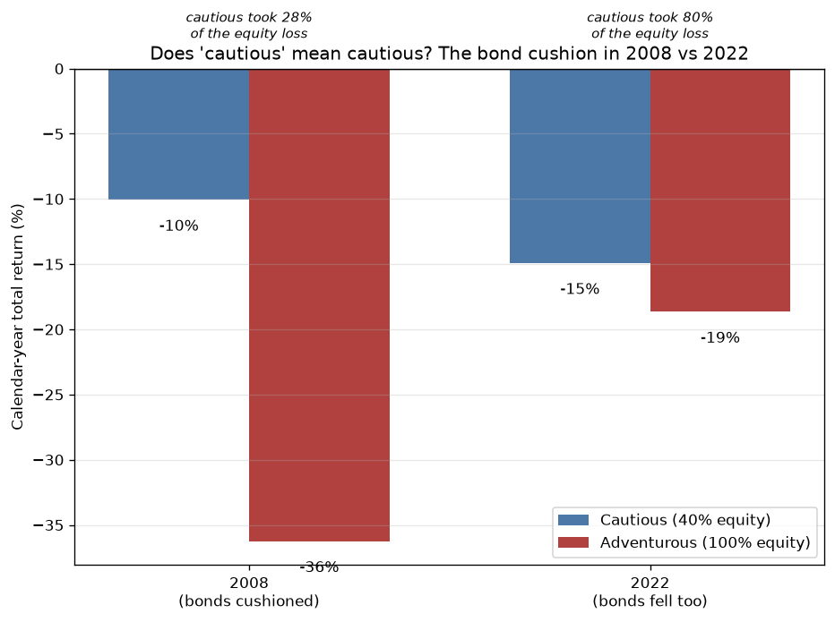
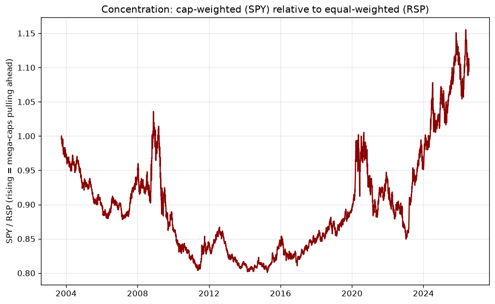
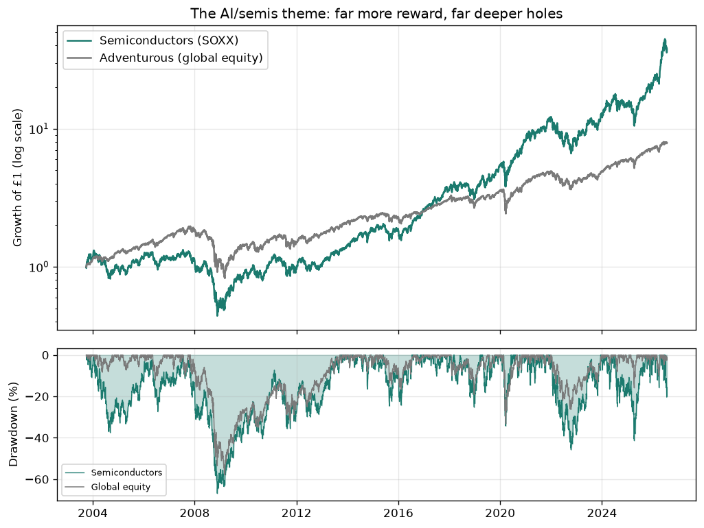
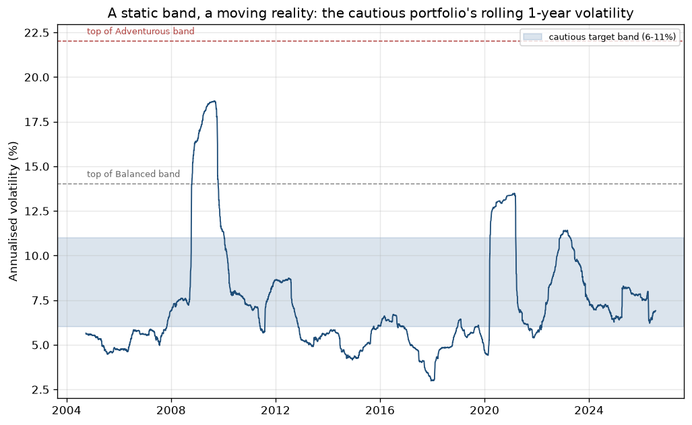
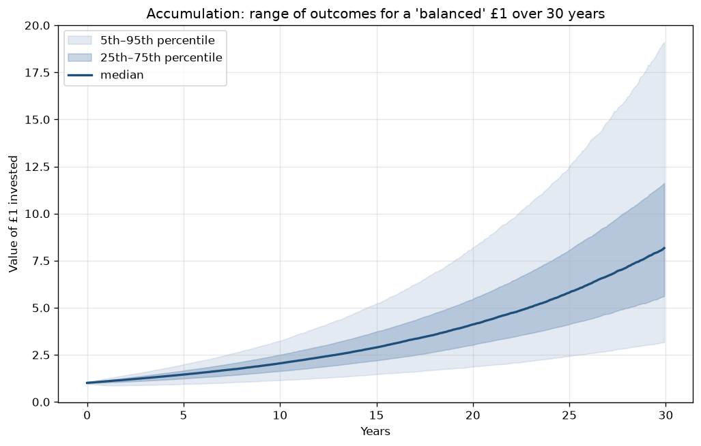
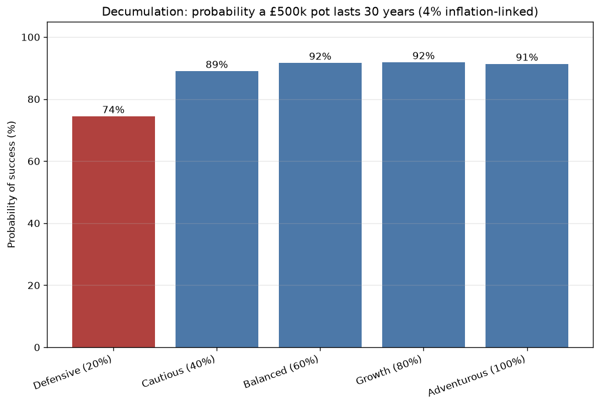

# Does "cautious" mean cautious?

Whether a single, static risk label can describe a portfolio whose risks move and a client whose needs change. Tested on almost 23 years of public market data (October 2003 to July 2026).

> Nothing here is investment advice. It is a historical analysis built from free, public data, using simplified index portfolios as proxies. All figures are in US dollars. For a sterling-based investor, currency moves and hedging can materially change returns, drawdowns, and recovery times, so the magnitudes here should not be read as a UK investor's exact experience.

---

## The question

When a wealth manager profiles a private client, the client is placed on a risk scale (for example cautious, balanced, adventurous) and mapped to a model portfolio. That one word is meant to tell the client how much risk they are taking.

This project tests how much that word can carry. The finding, in one line:

**A risk label is a useful ranking of portfolio risk, but an incomplete description of the risk a client actually faces, because the portfolio's risks and the client's needs both move while the label stays still.**

It helps to separate two ideas that the word "risk" runs together:

- **Market risk:** how much the portfolio can fall and fluctuate. Volatility, drawdown, time underwater.
- **Goal risk:** how likely the portfolio is to fail to meet the client's actual objective, such as not running out of money in retirement.

The label speaks to market risk, and only as a static ranking. The project shows three ways reality drifts away from it:

1. **Diversification drift.** The protection a cautious portfolio relies on can fail. In 2022 bonds stopped cushioning equities.
2. **Concentration drift.** A plain equity holding can quietly become a concentrated bet on a few giant companies, with no label changing.
3. **Objective drift.** The portfolio with the lowest market risk is not always the one most likely to meet the client's goal. For a long-horizon retiree, the "safest" portfolio can be the least likely to last.

## What a risk label is, and is not

A single word like "cautious" collapses several separate ideas that a suitability process is meant to keep apart:

- **Risk tolerance:** how much loss the client can emotionally sit through.
- **Capacity for loss:** how much loss the client can financially afford.
- **Time horizon:** how long the money can stay invested.
- **Risk requirement:** how much risk the client needs to take to meet their goals.
- **Portfolio risk:** the risk actually embedded in the holdings, which changes with markets.

The label mainly speaks to the last one, as a static ranking. Everything below is about the gap between that fixed word and a moving reality.

## Findings

### Finding 0: the labels rank market risk correctly

Across the full period the portfolios line up exactly as their labels promise. More equity meant more volatility and deeper drawdowns, every step of the way. This is the part the labels get right, and it matters: the argument that follows is not that labels are useless.

| Portfolio | CAGR | Volatility | Max drawdown | Worst 12 months |
|-----------|------|-----------|--------------|-----------------|
| Defensive (20% equity) | 4.6% | 5.5% | −18.1% | −16.9% |
| Cautious (40%) | 6.0% | 7.9% | −23.6% | −22.9% |
| Balanced (60%) | 7.3% | 11.2% | −36.2% | −31.0% |
| Growth (80%) | 8.4% | 15.0% | −47.7% | −41.0% |
| Adventurous (100%) | 9.5% | 19.2% | −58.1% | −51.0% |

A cautious portfolio really was far less risky than an all-equity one: about a third of the volatility, and less than half the worst drawdown. Hold onto that through the next section. It is the honest counterweight to what follows.

### Finding 1 (diversification drift): in 2022 the bond cushion gave far less protection than the label implies

A cautious portfolio leans on bonds to cushion equity losses. That cushion depends on bonds and equities not falling together. Usually they do not. In 2022 they did, as rising interest rates hit both at once.

| Year | Cautious (40% equity) | Adventurous (100%) | Cautious loss relative to the all-equity loss |
|------|----------------------|--------------------|-----------------------------------------------|
| **2008** | −11.1% | −38.8% | **29% as large** (bonds cushioned) |
| **2022** | −14.6% | −17.8% | **82% as large** (bonds fell too) |

Read that last column precisely. In 2022 the cautious portfolio's calendar-year loss was 82% as large as the all-equity portfolio's loss, against just 29% as large in 2008. This is a statement about one year's loss, not about overall risk. The cautious portfolio did not become 82% as risky as all-equity: over the full period it still had 7.9% volatility against 19.2%, and a −23.6% worst drawdown against −58.1%. The fair conclusion is narrower and more useful: the label correctly signalled lower risk on average, but on its own it would not have warned a client that a double-digit annual loss was possible in a year when diversification broke down.

**Why it happened: the diversification itself broke down.** The cushion depends on bonds and equities not moving together. For most of 2004 to 2021 they did not. The rolling 12-month correlation of their daily returns averaged −0.14 and was negative about two-thirds of the time, so bonds tended to hold up when equities fell. From 2022 that flipped. The correlation averaged +0.23, peaked near +0.40, and was positive on 96% of days. This is the specific, measurable reason behind the 2022 result, not a general appeal to "an unusual year."



**The part a client would feel most: recovery was slower, not faster, for the cautious investor.** Because equities rebounded in the 2023 to 2024 rally while bonds stayed depressed, the more cautious portfolios spent *longer* below their previous high after 2022, not less.

| Portfolio | Time to recover its early-2022 peak |
|-----------|-------------------------------------|
| Defensive (20% equity) | 2.6 years |
| Cautious (40%) | 2.4 years |
| Balanced (60%) | 2.1 years |
| Adventurous (100%) | 2.0 years |

Recovery time here is measured precisely: from each portfolio's highest daily total-return value in early 2022 to the first later day its value closed at or above that level, using daily data with dividends reinvested and annual rebalancing continuing through the drawdown. A cautious client who cares less about the size of a loss than about how long their money is stuck below where it started got the worse deal in this episode, despite holding the "safer" portfolio.



A currency note that belongs here, not just in the footnotes: these figures are in US dollars, and the bond leg is US aggregate bonds. A UK investor holding gilts or hedged global bonds in sterling would have had a different 2022, in both size and timing. UK gilts are widely reported to have fallen even harder that year, which suggests the direction holds, but the exact numbers are USD-specific.

### Finding 2 (concentration drift): the US equity market became far more concentrated in its largest companies

Because standard equity indices weight companies by size, a handful of very large winners can come to dominate the index and quietly raise every holder's concentration, with no risk label changing.

You can see this by comparing the normal cap-weighted S&P 500 (SPY) with its equal-weighted twin (RSP), where every company counts the same. When the cap-weighted version pulls far ahead, the largest few companies are carrying the market.

- **2023:** SPY returned +26.7% against RSP's +13.8%, a gap of **12.9 points**.
- **2024:** SPY returned +25.6% against RSP's +12.8%, a gap of **12.8 points**.

The cap-weighted index nearly doubled the equal-weighted one two years running. It is worth being careful about exactly what this proves, because the claim is easy to overstate:

- **Strongly supported:** US cap-weighted equity became increasingly dominated by its largest companies. Two straight years of double-digit gaps is a large, unusual concentration.
- **Plausible, not shown here:** many of those largest companies were the major beneficiaries of the AI investment cycle.
- **Not demonstrated by this analysis:** that a diversified portfolio therefore became a concentrated bet on "AI" specifically.

The SPY-versus-RSP gap is best read as evidence *consistent with* rising concentration, not a pure measurement of it, because the gap also reflects sector, size, valuation, and factor differences between the two indices. A direct measure would track the top-10 holdings as a share of the index over time. That needs constituent data this project does not use, and it is the clear next step. The suitability point survives the caveat, though: a "balanced" client in 2025 owns a more concentrated equity exposure than a "balanced" client in 2019, and nobody re-profiled them in between.



### Finding 3: a risk label does not reveal concentration risk

The label tells you roughly how much a portfolio can move. It tells you nothing about *where* that risk is concentrated. Two clients can share a label and hold completely different risks.

Take two "adventurous" clients. One holds a diversified global equity portfolio. The other holds 70% global equity and 30% semiconductors, a single-theme tilt. Both would be profiled as high risk. Their headline risk numbers even look similar. But they are not the same bet.

**The pure theme (semiconductors, SOXX, 100% in the sector):** returned **+68.8% in 2023**, but fell **−36.4% in 2022** and **−50.4% in 2008**, with a worst drawdown of **−67%** and volatility of 31%, close to double the diversified all-equity portfolio.

**The 70/30 tilt:** returned **+36.0% in 2023**, roughly twice the balanced portfolio, but its worst drawdown was **−58.7%**, and its risk is concentrated in one industry rather than spread across the market.

The reward was real, but only a client whose whole profile supported it could have collected it. Whether a semiconductor allocation is suitable does not reduce to "does the client have a high risk tolerance." It depends on tolerance, capacity for loss, time horizon, and the return the client actually needs, all being consistent with an allocation that can fall by more than half and stay down for years, and whose risk sits in a single theme. Two clients, same label, very different portfolios. The label hides that difference.



### Risk-targeting: a static band, a moving reality

There is a formal industry version of this project's question. UK risk profilers such as Dynamic Planner, Defaqto and EValue map each risk level to a target volatility band, and "risk-target managed" funds are run to keep their volatility inside it. So the natural test is whether each portfolio's realised volatility actually stayed in its band.

Using illustrative bands in the style of those providers (the specific numbers are illustrative, not any firm's proprietary figures):

| Portfolio | Target band | Full-period vol | Rolling 1-year vol below / in / above band | Peak 1-year vol |
|-----------|-------------|-----------------|--------------------------------------------|-----------------|
| Defensive (20% equity) | 4–8% | 5.5% | 51% / 36% / 13% | 13.4% |
| Cautious (40%) | 6–11% | 7.9% | 45% / 43% / 12% | 18.7% |
| Balanced (60%) | 9–14% | 11.2% | 53% / 34% / 13% | 26.7% |
| Growth (80%) | 12–18% | 15.0% | 53% / 31% / 16% | 36.8% |
| Adventurous (100%) | 15–22% | 19.2% | 52% / 31% / 17% | 49.4% |

On average, each portfolio's volatility sits inside its band, so the labels are calibrated correctly. But average is not experience. Over a rolling 12-month window, realised volatility spends most of its time *outside* the band: below it in the calm years, and above it in every crisis. The cautious portfolio's band tops out at 11%, but its rolling 1-year volatility reached 12.7% in 2020, breached 11% again in 2022, and hit 18.6% in 2008, which is the volatility of an adventurous portfolio. For those stretches a "cautious" client carried a much higher risk level, with nothing on their statement changing.



### Finding 4 (objective drift): the safest portfolio is not always the safest for the client's goal

The findings so far look backward and measure market risk. A wealth manager also has to look forward and ask about goal risk: will this portfolio actually meet the client's objective? The standard tool is Monte Carlo, running the portfolio through thousands of simulated futures.

The usual version assumes returns are bell-shaped and independent, which understates crashes and ignores the correlation shift documented above. So this simulation instead resamples real history in six-month blocks, keeping true crashes, fat tails, and the real joint behaviour of the assets. Ten thousand paths, thirty years.

**Accumulation: a label is a point, but the outcome is a wide distribution.** Growing a single pound for thirty years, the "balanced" portfolio has a median near £8, but the range runs from about £3.10 to £19.30 between the 5th and 95th percentile. Two clients in the same "balanced" model, retiring a few years apart, can end up with very different amounts through nothing but the luck of timing.



**Decumulation: for a long-horizon retiree, the most cautious portfolio was the least likely to last.** A retiree starts with £500,000 and draws 4% a year, rising with inflation, for thirty years. The base case:

| Portfolio | Probability the pot lasts 30 years |
|-----------|------------------------------------|
| Defensive (20% equity) | 74% |
| Cautious (40%) | 89% |
| Balanced (60%) | 92% |
| Growth (80%) | 92% |
| Adventurous (100%) | 91% |

The safest-sounding portfolio had the lowest chance of lasting. A defensive allocation grows too slowly to outrun inflation across a thirty-year drawdown, so it ran out in a quarter of the simulated futures.

**But a single simulation is not a general truth, so this was stress-tested across assumptions.** Survival probability by withdrawal rate (30-year horizon):

| Portfolio | 3.0% | 3.5% | 4.0% | 4.5% | 5.0% |
|-----------|------|------|------|------|------|
| Defensive (20%) | 99% | 93% | 74% | 46% | 20% |
| Cautious (40%) | 99% | 96% | 89% | 76% | 59% |
| Balanced (60%) | 99% | 96% | 92% | 85% | 75% |
| Growth (80%) | 98% | 95% | 92% | 87% | 81% |
| Adventurous (100%) | 97% | 95% | 92% | 87% | 82% |

And by horizon (4% withdrawal):

| Portfolio | 20 years | 30 years | 40 years |
|-----------|----------|----------|----------|
| Defensive (20%) | 100% | 74% | 27% |
| Cautious (40%) | 99% | 89% | 69% |
| Balanced (60%) | 99% | 92% | 82% |
| Growth (80%) | 98% | 92% | 86% |
| Adventurous (100%) | 97% | 91% | 87% |

The result is real but **conditional, not universal**, which is the important part. The "most cautious is least likely to last" effect appears at longer horizons (30 to 40 years) and moderate-to-high withdrawal rates (4% and above). It disappears over short horizons or at low withdrawals, where every portfolio survives comfortably. Over 20 years, or at a 3% withdrawal, the defensive portfolio is perfectly safe.

That conditionality *is* the point. Whether the "safe" portfolio is safe depends entirely on the client's objective: their horizon and how much they need to draw. A portfolio can have the lowest market risk and the highest goal risk at the same time. This is objective drift, and it is why suitability cannot be read off a single label.



The honest limitation stays in view. A block bootstrap reuses the 2003 to 2026 sample, so it captures the crashes that happened but cannot invent a future worse than anything on record. It is a stress test against history, not a forecast.

### A risk-adjusted view

Within this particular sample and methodology, judging the portfolios by return per unit of risk shows the ratios are close across the risk-graded portfolios: more risk bought more return, but not much more return per unit of risk. These figures depend on the risk-free assumption, return frequency, and sample period, so they describe this history rather than an inherent property of the portfolios.

| Portfolio | Sharpe | Sortino | Calmar | Longest spell underwater |
|-----------|--------|---------|--------|--------------------------|
| Defensive (20%) | 0.48 | 0.57 | 0.25 | 2.8 years |
| Cautious (40%) | 0.52 | 0.66 | 0.25 | 2.5 years |
| Balanced (60%) | 0.51 | 0.63 | 0.20 | 3.2 years |
| Growth (80%) | 0.48 | 0.60 | 0.18 | 5.2 years |
| Adventurous (100%) | 0.47 | 0.57 | 0.16 | 5.9 years |

(Sharpe and Sortino assume a 2% cash rate; the exact figure does not change the ranking.)

## Headline result

Over almost 23 years, the risk labels ranked market risk correctly, but the risk beneath a fixed label drifted in three ways. Diversification drift: in 2022 a "cautious" portfolio's loss was 82% as large as an all-equity portfolio's, against 29% in 2008, because the stock-bond correlation flipped from −0.14 to +0.23, and it then recovered more slowly than the aggressive portfolios. Concentration drift: cap-weighted US equity grew far more concentrated in its largest companies, so a "balanced" label in 2025 covers a different exposure than in 2019. Objective drift: for a long-horizon retiree drawing 4% or more, the most cautious portfolio was the *least* likely to last. A static label ranks market risk, but cannot capture goal risk, the changing shape of the portfolio, or a client's changing needs.

## Method

**Portfolios.** Five risk-graded portfolios defined by equity weight, rebalanced to target every year, plus one semiconductor-tilted sleeve. The equity portion is a global blend: every unit of equity is split 60% US, 30% developed markets outside the US, and 10% emerging markets, roughly global market-cap weight. The bond portion is US aggregate bonds.

| Portfolio | Equity (global blend) | Bonds |
|-----------|-----------------------|-------|
| Defensive | 20% | 80% |
| Cautious | 40% | 60% |
| Balanced | 60% | 40% |
| Growth | 80% | 20% |
| Adventurous | 100% | 0% |
| Semis-tilt | 70% global equity + 30% semiconductors | 0% |

**A note on framing.** This is an analysis of risk-graded multi-asset portfolios built from globally diversified equities and US aggregate bonds as proxies, priced in US dollars. It is *not* a model of any real UK wealth manager's portfolios, which would hold gilts, global and corporate bonds, hedged and short-duration bonds, cash, property, and alternatives, and would care about sterling returns. The equity/bond bands match how risk-graded portfolios are structured, and the equity is genuinely global, but the bond side and the currency are simplifications, and the results should be read with that in mind.

**Data.** Free total-return series (dividends reinvested) from Yahoo Finance. See the data-and-methods appendix for exact tickers, treatment, and limitations. The common window is October 2003 to July 2026, covering the 2008 crisis, the 2020 COVID crash, the 2022 rate shock, and the 2023 to 2025 AI boom.

## Limitations

What this project does **not** prove. This section is deliberately long, because the boundaries are the point.

- **Simplified portfolios.** Two- and three-asset allocations from broad indices, not any firm's real model portfolios.
- **US bonds and US dollars.** The bond side is a US aggregate-bond proxy and everything is priced in dollars. Currency and hedging can materially change a sterling investor's returns, drawdowns, recovery times, and even correlations. The UK conclusions here are directional, not precise.
- **Concentration is measured indirectly.** Finding 2 uses the cap-weighted versus equal-weighted gap, which is consistent with rising concentration but is not a direct holdings-based measure, and it is not proof of an AI-specific bet.
- **The Monte Carlo is a stress test against history, not a forecast**, and its decumulation result is conditional on horizon and withdrawal rate, as the sensitivity tables show.
- **No fees or tax.** Platform charges, fund costs, and ISA or pension wrappers are not modelled, and all of them matter to a real client.
- **Risk-adjusted figures are sample-specific**, depending on the risk-free assumption, frequency, and period.
- **The past is not a forecast.** Every finding is descriptive.

## Data and methods appendix

- **Source:** Yahoo Finance chart API, fetched directly (see `analysis/fetch_data.py`). Yahoo is adequate for an exploratory analysis of this kind; official index or provider data (S&P Dow Jones, MSCI, FRED, Morningstar) would be preferable for a formal paper, mainly for provenance and revision control rather than because the values are wrong.
- **Return measure:** Yahoo's split- and dividend-adjusted close, so each series is a total-return series (dividends assumed reinvested).
- **Tickers and roles:** SPY (US equity), EFA (developed ex-US), EEM (emerging), AGG (US aggregate bonds), RSP (equal-weighted US, concentration test only), SOXX (semiconductors, theme test only).
- **Window:** the common window across all series, set by the youngest (AGG, RSP), is late 2003 to mid 2026. ETF inception dates bound this; earlier history is not available for these exact instruments.
- **Frequency and rebalancing:** the historical analysis uses daily data with annual rebalancing on the first trading day of each year. The Monte Carlo uses monthly returns with monthly rebalancing; the difference is immaterial to the conclusions.
- **Missing data:** occasional gaps in the Yahoo series are dropped; series are inner-joined so only days present in every series are used.
- **Costs:** no transaction costs, fund fees, platform charges, or taxes are modelled.
- **Currency:** all series are in US dollars; no currency conversion or hedging is applied.
- **Monte Carlo:** historical block bootstrap, 6-month blocks, 10,000 paths, seeded for reproducibility. Assumptions (pot, withdrawal rate, inflation, horizon) are constants at the top of `analysis/monte_carlo.py` and are varied in the sensitivity tables.

## Reproducing the analysis

```
pip install -r requirements.txt
cd analysis
python3 fetch_data.py     # downloads the data into ../data/
python3 analyse.py        # the historical analysis: results.md and most figures
python3 monte_carlo.py    # the forward-looking simulation and its figures
```

Every number in this README comes from `analysis/analyse.py` or `analysis/monte_carlo.py`, and the full printouts are saved in `analysis/results.md` and `analysis/monte_carlo_results.md`.

## Data sources

Public market data from Yahoo Finance. No paid or proprietary data is used.
