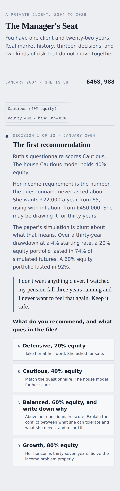

# The Manager's Seat

An interactive companion to [the main analysis](../README.md). The paper argues
that a static risk label describes market risk and misses goal risk. This puts
you in the chair and makes you find that out for yourself.

You are the discretionary manager for one private client, Ruth Alderman, from
January 2004 to July 2026. Thirteen decisions, real market history, and a score
at the end for three separate things: what happened to her money, whether what
she held was ever defensible, and how you treated her.



## Why this exists

The repository already has two pieces. The analysis paper makes the argument.
The Suitability Lens shows a manager what the argument looks like across three
client cases. Neither asks whether you could actually do the job.

Private-client discretionary management is two things held together: running a
portfolio, and being trusted with a person. Most portfolio projects show the
first. This one is built to test the second at the same time, because the
moments that decide a client relationship are not allocation problems. They are
a phone call in October 2008, a letter in October 2022, and a request for
£40,000 that is none of your business to refuse.

## The client

Ruth is 58 in January 2004 with £450,000 from selling her share of a family
printing business. She stops working at 65, wants £22,000 a year in 2004 money
rising with inflation, and would like it to last to 95. Her risk questionnaire
says Cautious.

The tension is deliberate and it is the ordinary case, not the exotic one. Her
questionnaire measures how she feels about losing money. It never asks what
return she needs. Those two answers point at different portfolios, and the first
decision in the simulator is what you do about that.

Ruth is invented. Nothing that happens to her is.

## What gets scored

**Outcome.** The pot she has in July 2026, and the probability her income lasts
to 95. That last figure comes from the paper's own block bootstrap in
`analysis/monte_carlo.py`, not from a second simulation written for this tool,
so the two can never disagree.

**Suitability.** Whether the equity weight she was actually holding stayed
inside a defensible range for her age, horizon and income need. This reads the
portfolio's real drifted weights, not the label on the model. A Balanced
portfolio left alone through 2008 stops being a balanced portfolio, and the
score notices.

**Conduct.** Whether she was told the truth, given the arithmetic before she
made her own decisions, and treated like an adult when it was uncomfortable.
This is the half of the job that never appears in a performance figure.

## Three managers, same client, same twenty-two years

The debrief runs your choices against three reference paths through the same
engine.

| Manager | Final pot | Income draw | Income lasts to 95 | Charges taken |
|---|---|---|---|---|
| By the book | £789,381 | 4.9% | 99% | £126,198 |
| Left alone | £438,555 | 8.7% | 45% | £117,769 |
| Her instincts | £14,942 | 257% | 0% | £77,671 |

**Left alone** takes the questionnaire at face value and never revisits it.
Cautious from the start, no glidepath, no cash reserve, every review a
formality. It is not negligent and it is not rare. It ends with a client drawing
8.7% of her pot at 80, and a 45% chance the income sees her out.

**Her instincts** is what Ruth would have done alone: safety first, cash
whenever it is frightening. She keeps almost nothing. That path still paid
£77,671 in charges along the way, which is the uncomfortable part.

**By the book** is every decision made the way the file would want it made,
documented, tied to her circumstances rather than to a forecast, and boring on
purpose.

The gap between the first two is the honest case for what a discretionary
manager is for, and it is not stock picking.

## How it works

**Real history, no pre-baked outcomes.** The page ships monthly total returns
for each underlying asset and computes any sequence of decisions from them. No
path is stored, and no scenario is invented. Change a decision and the arithmetic
runs again against the returns that actually followed.

**Positions drift.** The engine holds real positions and rebalances every
January, which is the convention the paper's historical analysis uses. Between
rebalances the weights move with markets. This matters: an engine that silently
held every model at its target weights could never show the thing the paper is
about, and the suitability score would be measuring a label rather than a
portfolio.

**One engine.** `engine.js` runs in the browser for the page and in node for the
tests. `test_engine.py` drives that same file and checks it against the same
arithmetic done independently in pandas. Two implementations of the same maths
would drift apart quietly, and the drift would surface in an interview rather
than in a test.

**The numbers in the prose are tested.** Every market figure quoted anywhere in
the decision script is recomputed from the CSVs by `test_decisions.py`. If a
figure in the narrative stops matching the data, the suite fails. The point is
that "where does 82% come from?" always has an answer.

## What is real and what is not

Real: every price, every return, every drawdown, every calendar-year figure, the
2007 peak date, the March 2009 low, the correlation flip, the cap-weighted
versus equal-weighted gap, and the survival probabilities.

Invented: Ruth, her family, the wording of what she says, and the option scores.
The scores are judgments, not measurements. They are written down in
`decisions.py` where they can be read and argued with rather than buried in the
code.

## Limitations

These matter and they are the same ones the main paper carries, plus two of this
tool's own.

- **US assets, US dollars.** The equity is a global blend but the bond sleeve is
  US aggregate and everything is priced in dollars. A sterling investor holding
  gilts would have had a different 2022 in both size and timing. The direction of
  every finding holds. The exact magnitudes are dollar figures.
- **Monthly, not daily.** The engine runs on monthly returns. Where the
  narrative quotes a sharp intra-month move, such as the 33.1% fall between 19
  February and 23 March 2020, that figure is measured from daily data and stated
  as a daily figure. Monthly volatility figures are also naturally lower than the
  daily ones in the main paper, so the two are not directly comparable.
- **Cash is flattered.** The cash leg earns the 13-week Treasury bill rate with
  no platform margin deducted, so panicking into cash looks slightly better here
  than it was in reality. The bias runs against the argument the tool ends up
  making, which is the safe direction for a bias to run.
- **An all-cash ending is scored generously.** The survival grid's lowest
  allocation is 100% bonds, so a player who finishes in cash is scored as though
  they held short bonds. Again this flatters the worst choice.
- **The block bootstrap resamples 2003 to 2026.** It keeps real crashes and real
  fat tails, and it cannot invent a future worse than anything on record. It is a
  stress test against history, not a forecast.
- **The scores are opinions.** Defensible ones, written down, but opinions. A
  different manager would mark some of these differently and the interesting
  conversation is about which ones.

## Running it

```
pip install -r ../requirements.txt
cd managers-seat
python3 fetch_extra.py     # only needed once, adds SHY and the T-bill rate
python3 build.py           # writes game.json, index.html, transcript.md
python3 -m pytest -q       # 38 tests
python3 shots.py           # browser checks and phone-width screenshots
```

`build.py --fetch` refreshes all market data first. Open `index.html` in any
browser. It works offline and needs no server.

## Files

| File | What it is |
|---|---|
| `client.py` | Ruth: pot, goal, cash flows, and the suitability bands. Pure data. |
| `decisions.py` | The thirteen decisions and every option. Pure data. |
| `market.py` | Monthly asset returns and the model portfolios, from `../data/`. |
| `survival.py` | The endgame grid, built from the paper's block bootstrap. |
| `engine.js` | The replay engine. Used by the page and by the tests. |
| `template.html` | The page. |
| `render.py` | Inlines the data and the engine into a self-contained file. |
| `build.py` | Runs the lot and writes `transcript.md`. |
| `shots.py` | Drives a real browser: checks, then screenshots at 390px. |
| `transcript.md` | Every decision and option as text, readable on a phone. |

`transcript.md` is generated, so it cannot drift out of step with the page. If
you want to read or argue with the writing without running anything, start
there.
